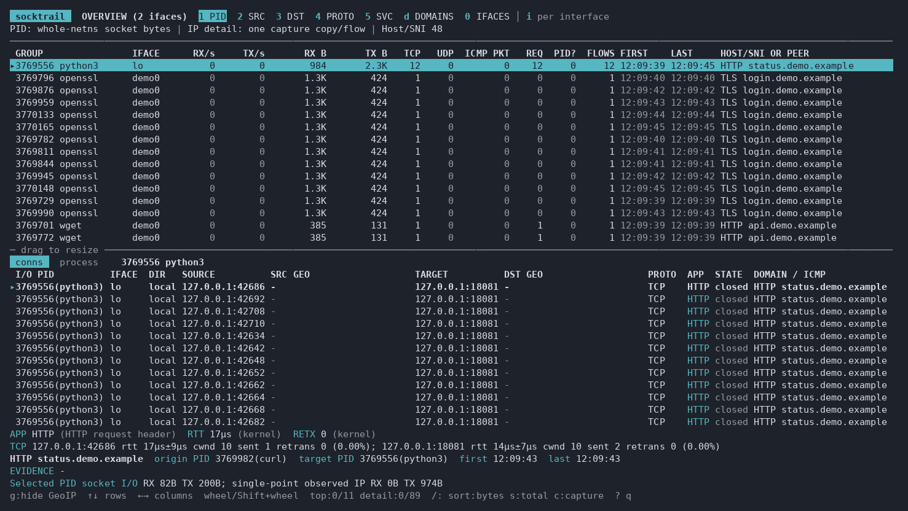
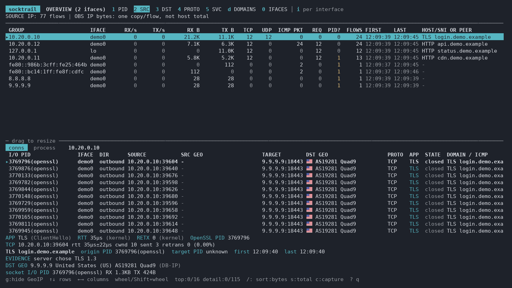
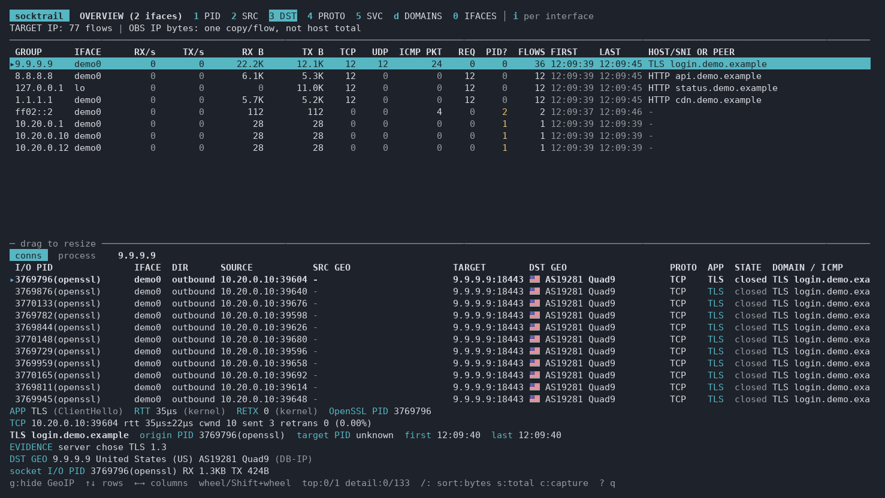
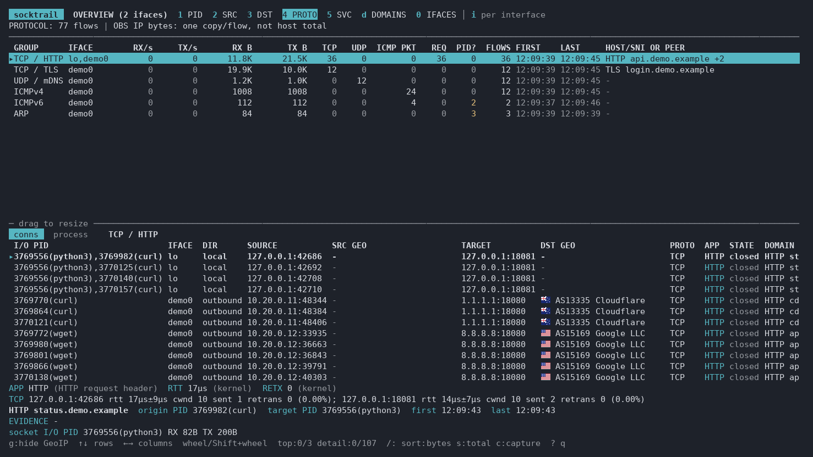
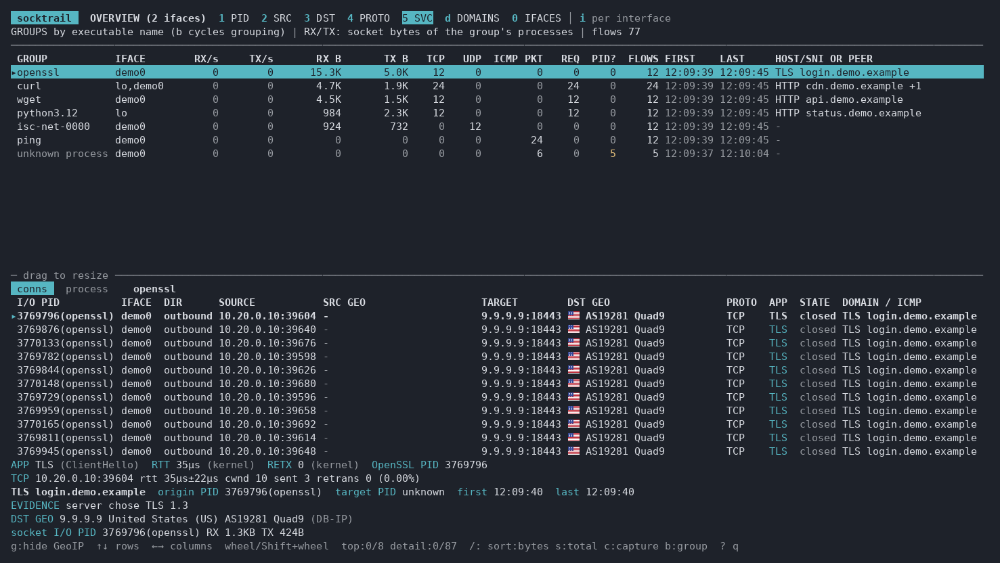
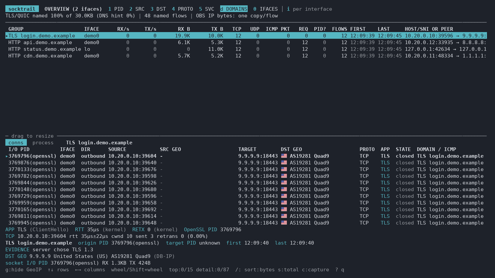
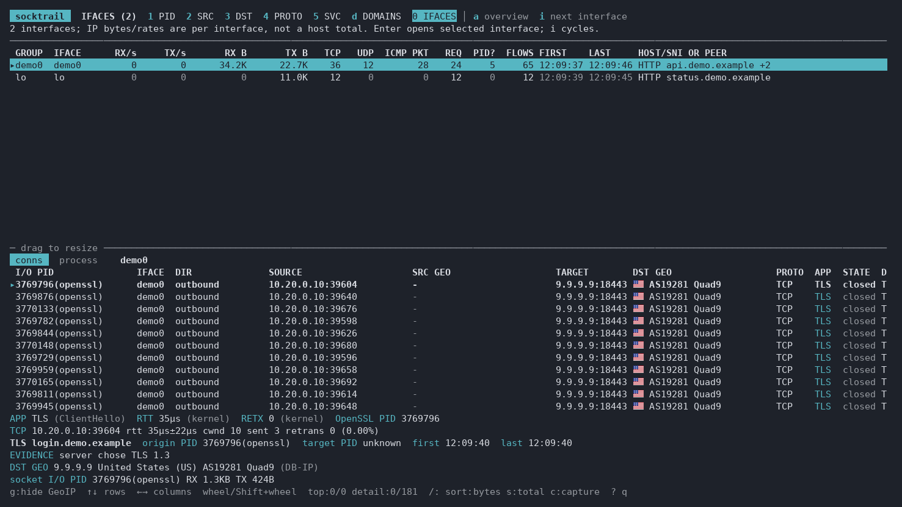

<h1 align="center">socktrail</h1>

<p align="center">
  <strong>See Linux network traffic, connections, processes, and visible domains in one terminal.</strong>
</p>

<p align="center">
  <a href="https://github.com/jimyag/socktrail/actions/workflows/check.yaml"></a>
  <a href="https://github.com/jimyag/socktrail/actions/workflows/kernels.yaml"></a>
  <a href="https://github.com/jimyag/socktrail/releases/latest"></a>
</p>

<p align="center">
  <a href="#why-socktrail">Why socktrail</a> ·
  <a href="#features">Features</a> ·
  <a href="#screenshots">Screenshots</a> ·
  <a href="#build-and-run">Build and Run</a> ·
  <a href="#documentation">Documentation</a>
</p>

<p align="center">
  <strong>English</strong> · <a href="README.zh-CN.md">简体中文</a>
</p>

---

socktrail is a Linux terminal application for inspecting live network traffic. It captures packets from selected interfaces with AF_PACKET and uses eBPF socket probes and the kernel socket table to associate local traffic with processes. The interface shows connections, IP traffic, application protocols, and domain names found in observable HTTP, TLS, QUIC, proxy, and DNS data.

It is a prototype. It has been tested on a Linux 6.8 host; probe loading and loopback traffic are also checked in virtual machines on x86-64 kernels from 5.10 to 7.0, including CentOS Stream 9 and 10, and on arm64 kernels 6.4 and 6.8; CI runs the root tests on amd64 and arm64 runners. NAT, Docker bridge/host networking, and explicit cross-namespace capture were tested locally, including a kind CoreDNS Pod; protocol detection was checked against more than ten real services, including Kafka, SQL Server, and gRPC. To attribute bridge-container processes, select their network namespace with `--netns`; see the [measurement rules](docs/user/measurement.md#docker-网络) and [validation record](docs/archive/validation.md).

## Why socktrail

Packets, processes, and domain evidence answer different questions. socktrail brings them into one view while keeping packet bytes separate from socket I/O bytes. It can help you find which process owns a connection, where traffic goes, which interface saw it, and whether a visible Host or SNI identifies the destination.

## Features

- Capture IPv4, IPv6, ARP, and other Ethernet traffic. Automatic selection uses up to eight interfaces; explicit `--interface` selection has no count limit and can include loopback and tun interfaces.
- Capture selected network namespaces with repeatable `--netns` (path, name, `pid:PID`, or `container:ID`); interface labels identify their namespace.
- Group TCP, UDP, ICMP, and other flows; show application protocol hints, connection state, RTT, congestion window, retransmissions, and sampled TCP bottleneck hints (kernel values for local sockets, like `ss -ti`), DNS response time, and ICMP errors.
- Opt into kernel packet drop reason counts with `--drops`; the status screen and JSON snapshot show the totals, and matching connections show their own counts.
- Associate local TCP/UDP sockets with processes and show socket RX/TX separately from captured IP bytes.
- Group processes by systemd service or container, cgroup, process tree, or executable basename, and show only chosen processes with `--process`, `--pid` (with descendants), `--cgroup`, or `--container`.
- Show local Docker container and Compose service names, plus Kubernetes Pod names when kubelet log links are available; unreadable metadata falls back to the short container ID.
- Use conntrack data to merge observed flows across NAT address changes when a mapping is available.
- Extract visible HTTP Host, TLS and QUIC SNI, proxy targets, and DNS name hints. Encrypted HTTP request names and real ECH inner names are not available from packet capture.
- Inspect PID, source IP, destination IP, protocol, domain, and per-interface views in the terminal.
- Record the next 15 seconds of packets for a selected connection or PID to a PCAPNG file on demand, optionally starting with the frames of the seconds before.
- Print a timed snapshot as a text report or a JSON document.
- Stream connection changes as NDJSON and inspect recent changes in the `6 LOG` view.
- Inspect listening TCP/UDP ports, owning processes, accept queues, and failed attempts in `7 PORTS`.
- Diagnose failed outbound TCP connects by process, target, and kernel error; inspect connect latency for successful and failed attempts.
- Optionally enrich a selected connection with offline DB-IP Lite country and ASN data.

## Screenshots

These screenshots show socktrail processing synthetic traffic in isolated Linux network namespaces. The `10.20.0.0/24` network is private; the public IPs shown were assigned locally inside the demo namespace, and the `.demo.example` domains are synthetic. No personal traffic or external connections are shown.

### PID



### Source IP



### Destination IP



### Protocol



### Process groups



### Domains



### Interfaces



## Build and Run

Running socktrail requires Linux and a kernel with BTF, fentry, and BPF ring buffer support: 5.10 or later on x86-64, and 6.4 or later on arm64, where fentry depends on ftrace direct calls. Building from source requires Go 1.27. The eBPF object files are included, so a normal build does not require clang. Run with privileges sufficient for packet capture and eBPF loading; `sudo` is the simplest option.

Prebuilt Linux amd64 and arm64 binaries are available as uncompressed files on [GitHub Releases](https://github.com/jimyag/socktrail/releases). To download, verify, and install the latest release to `/usr/local/bin`:

```sh
curl -fsSL https://raw.githubusercontent.com/jimyag/socktrail/main/install.sh | sh
```

The installer asks for `sudo` if the destination is not writable. For releases after v0.0.1, it also verifies the build provenance attestation when GitHub CLI 2.49 or later is installed and signed in; otherwise it checks only the SHA-256 checksum. Run the installed binary with `sudo socktrail`, or follow the [file capability setup](docs/user/usage.md#不使用-sudo-运行).

For a source build, `task` (or `task build`) creates a static binary with the Git version and build time, and `task install` installs it to `/usr/local/bin/socktrail` with the file capabilities needed for packet capture and eBPF. Run `task install` as your normal user; it invokes `sudo` only for installation. Then run `socktrail` without `sudo` for core capture. Use `sudo socktrail` when you need all probes, including OpenSSL process SNI and kernel TLS on hosts that restrict module BTF access.

From the repository root, `go install .` installs the binary to your Go binary directory. It does not set Linux file capabilities.

```sh
CGO_ENABLED=0 go build -o socktrail .
sudo ./socktrail
sudo ./socktrail --interface lo
sudo ./socktrail --interface lo --interface eth0
sudo ./socktrail --interface eth0 --duration 30s --output json
sudo ./socktrail --netns container:0123456789ab --interface eth0
sudo ./socktrail --netns pid:1 --netns pid:12345 --interface lo
./socktrail --download-geoip-db
./socktrail --version
```

Without `--interface`, socktrail selects up to eight active interfaces: physical interfaces first, then loopback, tunnels, and host bridges. Container veth links, Docker bridges, and VM tap links require an explicit `--interface`; it accepts repeated names, comma-separated names, and glob patterns such as `'veth*,br-*,vnet*'`. Explicit selection has no interface-count limit. Use `ip -br link` to find interface names.
`--netns` selects one or more network namespaces; without it, only the current namespace is captured. Each `--interface` pattern is resolved inside every selected namespace and must match there. The target's interface label is prefixed with its namespace name. `container:ID` finds a visible process by a hexadecimal container ID prefix of at least 12 characters.
Replace the example ID and PID with those of the target container or Pod process.
`--interface lo` captures loopback connections only, even with multiple `--netns` targets. For Pod ingress or egress, select its `eth0` and check the actual capture interfaces on the `0` screen or in JSON `interfaces`. With `--drops`, the global drop totals cover every interface in the selected namespaces, including interfaces outside the packet capture selection.

Explicit capture on more than eight interfaces shows the matches and asks for confirmation. It starts in a systemd scope with a 512 MiB memory limit by default. Use `--yes` for non-interactive runs, `--memory-limit=1GiB` to change the limit, or `--memory-limit=none` to opt out of it. A protected run fails before capture if systemd is unavailable.

To run without `sudo`, install the binary with Linux file capabilities. Network capabilities alone do not cover the eBPF probes; see the [capability setup and limitations](docs/user/usage.md#不使用-sudo-运行).

Press `1`–`4` for PID, source IP, destination IP, and protocol views; `5` for process groups, where `b` switches between service, cgroup, process tree, and executable basename; `6` for the LOG view (`b` switches change groups); `7` for listening ports; `d` for domains; `0` for interface diagnostics; `?` for help; and `q` to quit. Press `g` to show or hide GeoIP for both endpoints, or to download the databases from inside the TUI when missing. Select a connection or PID and press `c` to start or stop a PCAPNG recording; start with `--record-before 10s` to include the ten seconds before the key press. Recordings go to `$XDG_STATE_HOME/socktrail/captures` (usually `~/.local/state/socktrail/captures`) by default and may contain plaintext application data. Use `--capture-dir /tmp/...` for temporary files.

Run `socktrail --download-geoip-db` as your normal user to install optional [DB-IP Lite](https://db-ip.com/db/lite.php) country and ASN databases in `$XDG_DATA_HOME/socktrail/geoip` (usually `~/.local/share/socktrail/geoip`). Capture never downloads automatically and still works without them; pressing `g` in the TUI offers an explicit download. When enabled, the connection table shows country flag, ASN number, and a short organization name separately for source and target public IPs. The selected connection detail and JSON snapshots retain full names; `--geoip-dir` selects another database directory. DB-IP Lite is licensed under CC BY 4.0.

## Documentation

The [documentation index](docs/README.md) groups the Chinese user guides, implementation notes, and historical validation record. See also the [简体中文 README](README.zh-CN.md).

## Development

```sh
go run github.com/golangci/golangci-lint/v2/cmd/golangci-lint@v2.14.0 run ./...
go test -race ./...
CGO_ENABLED=0 go build .
```

GitHub Actions also checks Go formatting on pushes to `main` and pull requests, runs the probe and capture tests as root on amd64 and arm64 runners, takes a snapshot of test traffic with `test/smoke.sh`, and checks that the committed eBPF objects match their sources. The [kernel matrix](.github/workflows/kernels.yaml) boots each distribution kernel of `test/vm/kernels.txt` in QEMU with `test/vm/run.sh`, one job per kernel, weekly and whenever the probes change; run it locally with `test/vm/run.sh amd64` or `test/vm/run.sh arm64`, optionally followed by kernel names.

## Release

Pushing a `v*` tag runs the checks, then GoReleaser publishes static Linux amd64 and arm64 binaries plus `checksums.txt` to [GitHub Releases](https://github.com/jimyag/socktrail/releases), and the workflow attests their build provenance; check a downloaded binary with `gh attestation verify socktrail_linux_amd64 --repo jimyag/socktrail`. `socktrail --version` prints the tag, build time, and Go version. Run `goreleaser release --snapshot --clean` to check the release build locally.
